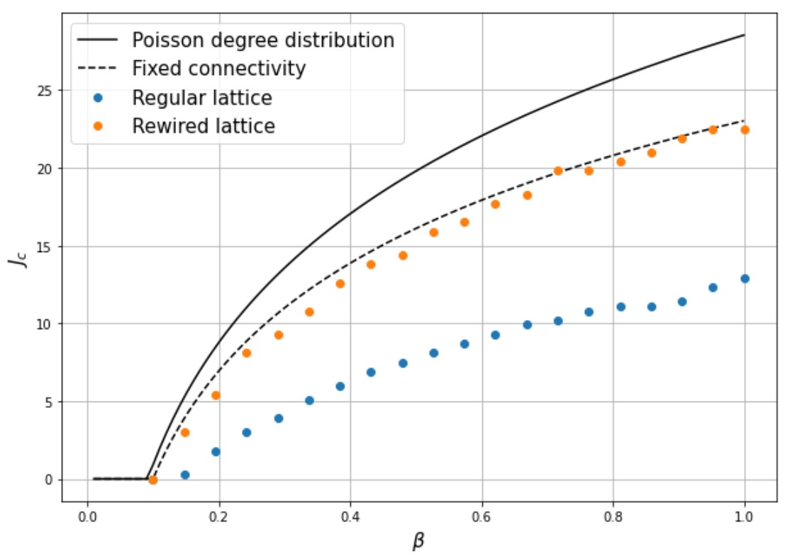
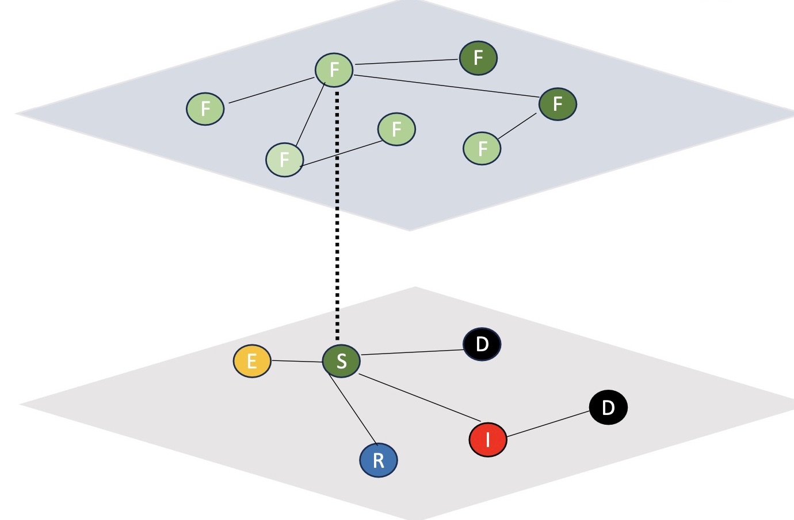
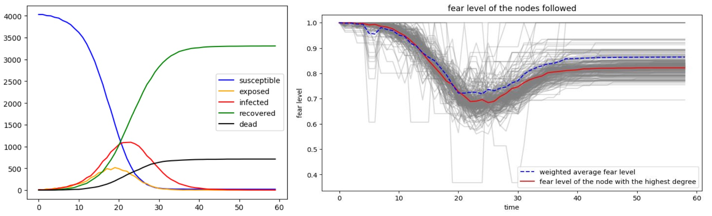
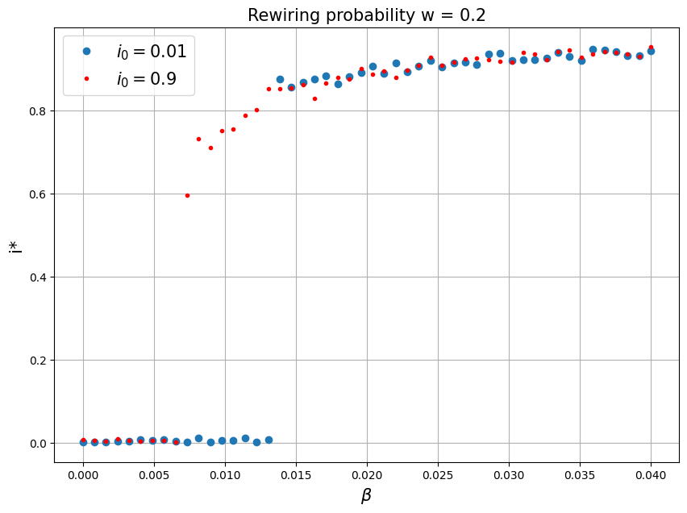
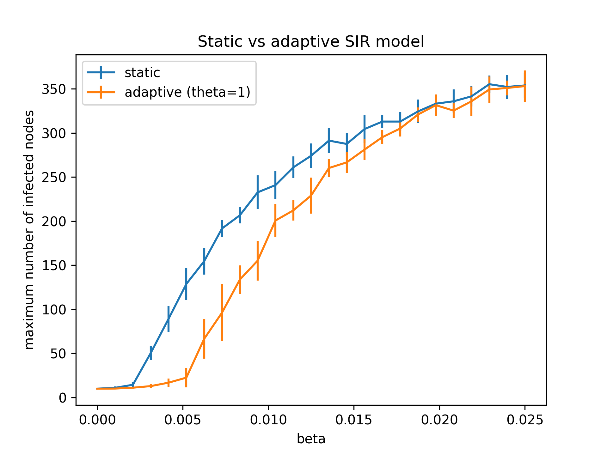

# Behaviour adaption to epidemics

 ## overview

 In this project we develop epidemiological models on complex networks to explore how behavioral adaption to epidemic can alter the epidemic itself.
 This project was developed for the course Life data and epidemiology at uniPD.

 ## Project Components
 
 1. SIS with risk perception
    
 We assume the perception of the risk of being infected depends on the fraction of neighbors that are ill and study this behaviour in the mean-field approximation and by numerical simulations for regular, random and scale-free networks. For more details see the notebook `SIS_fear_Bagnoli` and the reference Bagnoli et al. https://doi.org/10.1103/PhysRevE.76.061904

 

    <figure>
        
        <figcaption> Critical value Jc of the precaution level as a function of the base infectivity   </figcaption>
    </figure>

   
 2. Two layer model: SEIRD for the epidemic in the physical net and spreading of Fear in the social net
    
We separate physical layer of contact with social layer by modelling two different dynamics. The first layer on which a classic  SEIRD epidemic can spread and a second layer where we link fear with the number of diseased/death neighbors of the node simulating the spreading of the fear in an individual. In this way the infectivity is not more a global parameter but depends on the node itself and its fear level. Check the implementation in the `SEIRD_fear` module and the plots in `SIR_SEIRD_fear_plots` notebook.

    <figure>
        
        <figcaption> Top layer is the fear network and lower layer is the epidemic SEIRD layer.  </figcaption>
    </figure>

  

    <figure>
        
        <figcaption> Stochastic simulation of the dynamics, the fear level increases as the fraction of infected/deaths neighbours increases thus lowering the infectivity.  </figcaption>
    </figure>

   
 3. SIS on adaptive network
    
We study the epidemic dynamics on an adaptive network, where the susceptibles are able to avoid contact with infected by rewiring their network connections. This dynamic leads to oscillations and hysteresis. For more details see the notebook `Adaptive_SIS`.

    <figure>
        
        <figcaption> Simulation of SIS that leads to the bistability and hysteresis loop.  </figcaption>
    </figure>

   
 4. SIR on adaptive network

We further study the effect of the rewiring on $R_{0}$, time to extinction and maximum number of infected nodes. For more details see the notebook `SIR_SEIRD_fear_plots` and the module `SIR_adaptive`.

    <figure>
        
        <figcaption> For lower values of the infectivity the rewiring helps the epidemic to slow down but when we increase the speed of the infectivity the rewiring has the opposite effect. </figcaption>
    </figure>

